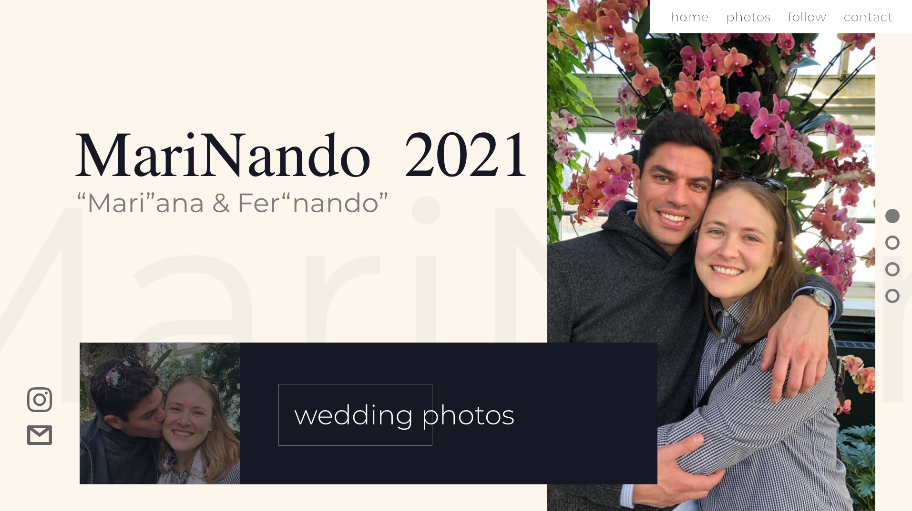
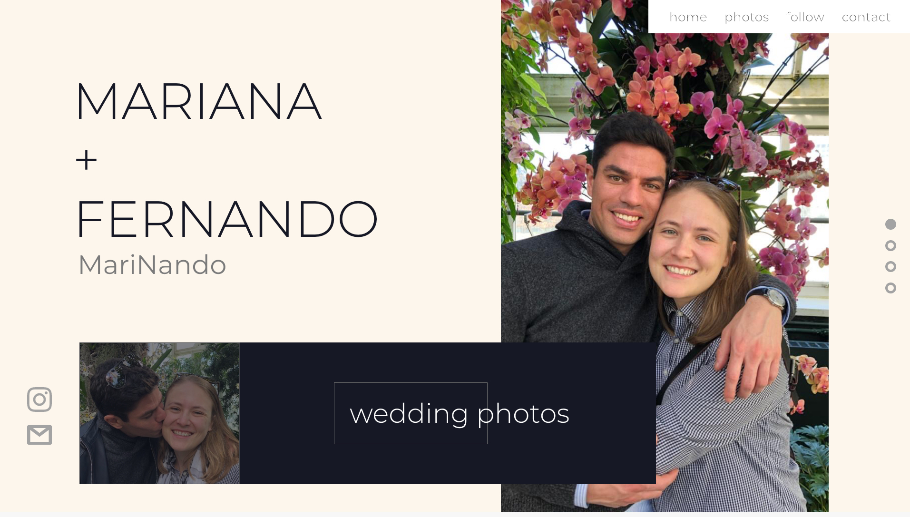
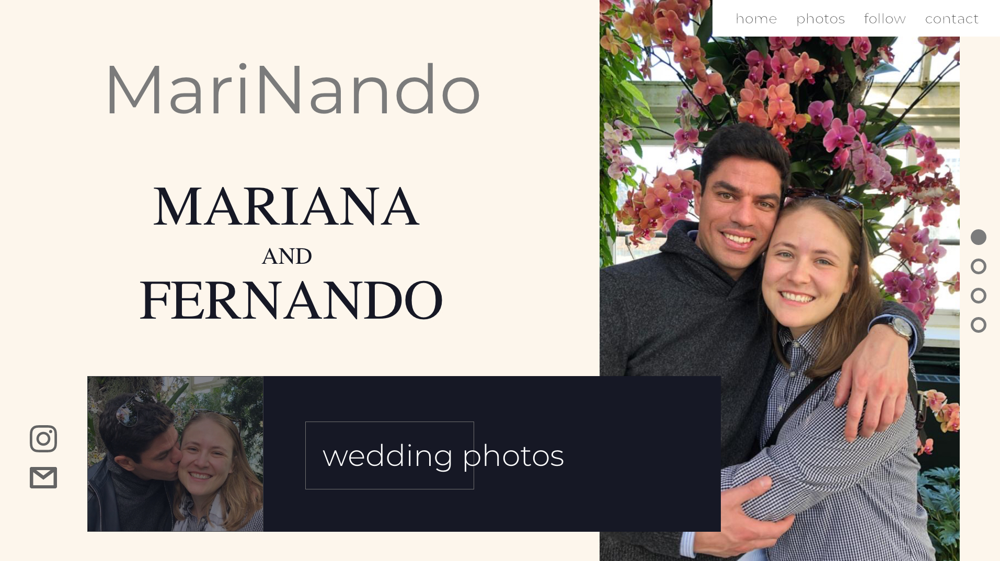
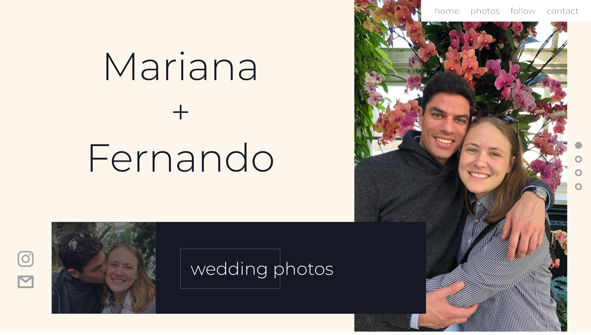
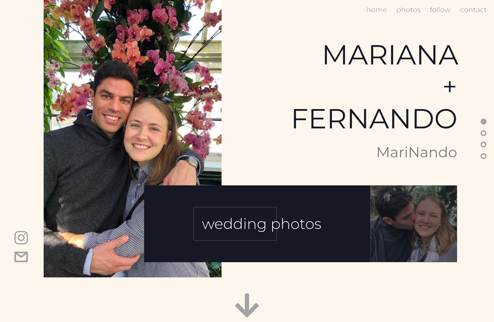
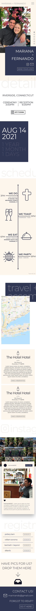

# Marinando
### (Mar)iana + Fer(nando) Wedding Webiste 

 

## OVERVIEW
This is a personal project I coded from scratch for my sister's wedding, designed by me and coded entirely on html, css and javascript. In this project I forced myself not to use PHP, partially to explore other possibilities on javascript, and partially to be able to post the site on [Netlify](https://netlify.com) for free. I also tried to explore some javascript libraries like [Jquery](https://jquery.com) and [Anime.js](https://animejs.com/), and tried to incorporate Adobe Suite as much as possible to get more comfortable with the programs. Additionally, as my family is bilingual, I had to translate the entire website to spanish to make it accesible to all invitees (options for language are at the footer of the website).
  
**LIVE LINK:** [marinando2021.com](https://marinando2021.com)

 

## PROCESS
I will take you through my process of designing this website.

### DESIGN
* Adobe Xd was design platform of choice
* Chose to do a one page scroll type website
  * Not too much information to deal with
  * Possibility of scroll animations and nice phone usability
  
1. **Overall structure and plan of site**
    * Start in invitation; Then to an rsvp form; Finally to the main website
      * Allows for client to send invitation and takes them through the entire process
    * One page navigation with fun graphics
    * Site Map:  
      \- Home  
      \- Details  
      \- Schedule  
      \- Travel + Accomodation  
      \- Registry  
      \- Contact
    * RSVP form with video from couple explaning the invitation when coming to the main page from the invitation

2. **Concept design for home page**
    

      
Expand to see all concept designs

      
      
      
        
      

    

    I wanted a broken layout feel to the website while still maintaing friendly, as it is a wedding website and not corporate marketing. So, I kept neutral color tones and a nice rounded font to seem a little more inviting.

3. **Full height website / content design**

    

      
Expand to see full desktop design

      
    

    

      
Expand to see full phone design

      
    

    
    Different from the original concept designs, I switched to a brighter navy blue to make the website more vibrant and therefore more approachable. Also kept it fun by changing font sizes and font weights. However, I realized that because there were so many changes it became too cluttered, and therefore extremely too busy for a one page design. 
    
    The titles of the sections, however fun they were, made the sections seem extremely uneven and uncomfortable. Additionally, some sections were too large in comparison to their importance, for example, the registry. I knew my clients didn't want to flaunt their registry, so I put it at the end, yet it was still too big.

4. **Refined full page design**

    

      
Expand to see refined full desktop design

      
    

    As you can see, this design is much more cohesive in, its margins, its section sizes, and text sizing. First order of business for this design was to remove/reincorporate the titles of the sections in a more discrete way. This meant smaller fonts, higher opacity and offcenter positioning

    I then changed the details/schedule section by getting all the information and shoving it into one section. Not visualized though, is how the block to the left of the timeline is sticky and follows you down the schedule. This allows for contextualization and a guide for the eyes to follow. Additionally, it allows for the user to then see the jot it down call to action button which will allow them to write the date down in commonly used platforms. 

    A small yet significant change was the buttons underneath the map in the 'travel + accomodations' section. This allows for more user interaction and ease of use when it comes to the purpose of the section, travel and accomodations. 

    Lastly, as mentioned in the previous section, I reduced the size of both the footer and the registry sections. The fonts, the padding, everything was too large. This did not really fit the other sections. So, I decided to make it much smaller for ease of use and to fit the needs of my client better.

    This was by no means the final design, as things inevitably change durring the development process.
